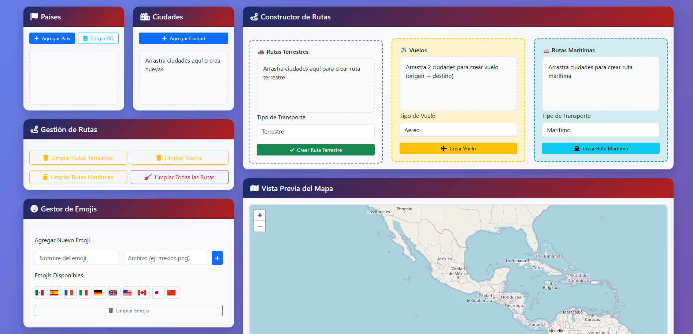

# 🌍 Generador de Mapas Interactivo - Drag & Drop

Una aplicación web moderna para crear mapas interactivos con rutas terrestres, aéreas y marítimas mediante una interfaz drag & drop intuitiva.

## ✨ Características Principales

### 🗺️ Gestión de Elementos
- **Países**: Crear y personalizar países con banderas, colores y emojis
- **Ciudades**: Agregar ciudades con coordenadas precisas y descripciones
- **Rutas**: Crear diferentes tipos de rutas:
  - 🚗 **Rutas terrestres**: Conexiones por carretera
  - ✈️ **Vuelos**: Rutas aéreas entre ciudades
  - 🚢 **Rutas marítimas**: Conexiones por mar

### 🎨 Interfaz de Usuario
- **Drag & Drop**: Interfaz intuitiva para arrastrar y soltar elementos
- **Mapa Interactivo**: Vista previa en tiempo real usando Leaflet.js
- **SweetAlert2**: Notificaciones y confirmaciones elegantes
- **Diseño Responsive**: Compatible con diferentes dispositivos

### 💾 Gestión de Datos
- **Almacenamiento Local**: Guarda automáticamente en el navegador
- **Importar/Exportar JSON**: Intercambia datos fácilmente
- **Base de Datos Integrada**: Gestión de países y ciudades predefinidas

## 🚀 Instalación y Uso

### Requisitos Previos
- Navegador web moderno (Chrome, Firefox, Safari, Edge)
- Conexión a internet (para cargar librerías CDN)

### Instalación Rápida
1. Descarga todos los archivos del proyecto
2. Abre `index.html` en tu navegador
3. ¡Comienza a crear tu mapa!

### Estructura de Archivos
- **map-generator/**
  - `index.html` - Archivo principal
  - **banderas/** - Carpeta para imágenes de banderas
    - `Mexico.ico`
    - `Spain.ico`
    - ...
  - **iconos/** - Carpeta para iconos de transporte
    - `autobus.png`
    - `vuelo.png`
    - `barco.png`
  - `README.md` - Este archivo

## 📖 Guía de Uso

### 1. Configuración Inicial
1. **Agregar Países**: Haz clic en "Agregar País" para crear nuevos países
2. **Personalizar**: Asigna colores, banderas y emojis a cada país
3. **Guardar**: Los países se almacenan automáticamente en tu navegador

### 2. Creación de Ciudades
1. **Nueva Ciudad**: Usa el botón "Agregar Ciudad"
2. **Coordenadas**: Introduce latitud y longitud exactas
3. **Descripción**: Añade información adicional sobre la ciudad

### 3. Construcción de Rutas

#### Rutas Terrestres
1. Arrastra ciudades al contenedor "Rutas Terrestres"
2. Selecciona el tipo de transporte
3. Haz clic en "Crear Ruta Terrestre"

#### Vuelos
1. Arrastra exactamente 2 ciudades (origen y destino)
2. Selecciona el tipo de vuelo
3. Haz clic en "Crear Vuelo"

#### Rutas Marítimas
1. Arrastra múltiples ciudades para rutas marítimas
2. Selecciona el tipo de transporte marítimo
3. Haz clic en "Crear Ruta Marítima"

### 4. Gestión de Datos

#### Exportar JSON
1. Haz clic en "Generar JSON"
2. Usa "Copiar" para guardar en el portapapeles
3. El JSON incluye toda la configuración del mapa

#### Importar JSON
1. Haz clic en "Cargar desde JSON"
2. Pega tu JSON en el modal
3. Confirma para cargar todos los datos

## 🛠️ Tecnologías Utilizadas

- **Frontend**: HTML5, CSS3, JavaScript (ES6+)
- **Mapas**: [Leaflet.js](https://leafletjs.com/)
- **UI Framework**: [Bootstrap 5](https://getbootstrap.com/)
- **Iconos**: [Font Awesome](https://fontawesome.com/)
- **Notificaciones**: [SweetAlert2](https://sweetalert2.github.io/)
- **Almacenamiento**: LocalStorage del navegador

## 🐛 Solución de Problemas

### Problemas Comunes

1. **Las rutas no se muestran en el mapa**
   - Verifica que las ciudades tengan coordenadas válidas
   - Asegúrate de que hay al menos 2 ciudades en la ruta

2. **Los países no se guardan**
   - Verifica que el navegador permita localStorage
   - Intenta recargar la página

3. **El mapa no carga**
   - Comprueba tu conexión a internet
   - Verifica la consola del navegador para errores

## 📄 Licencia

Este proyecto está bajo la Licencia MIT.

## 🌟 Próximas Características

- [ ] Exportación a imagen del mapa
- [ ] Compartir mapas en línea
- [ ] Plantillas predefinidas
- [ ] Múltiples capas de mapa
- [ ] Estadísticas avanzadas de rutas

---

**¿Listo para crear tu mapa?** 🗺️ ¡Abre `index.html` y comienza tu aventura cartográfica!